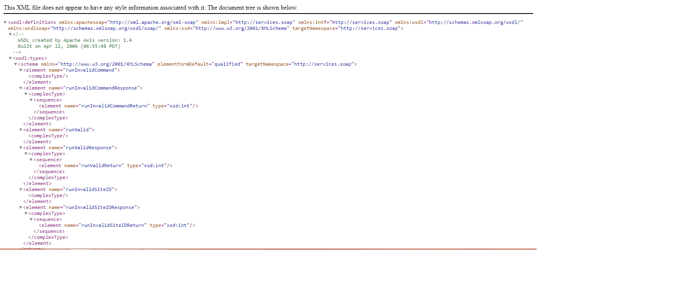
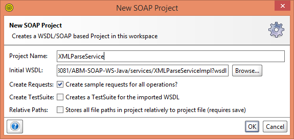
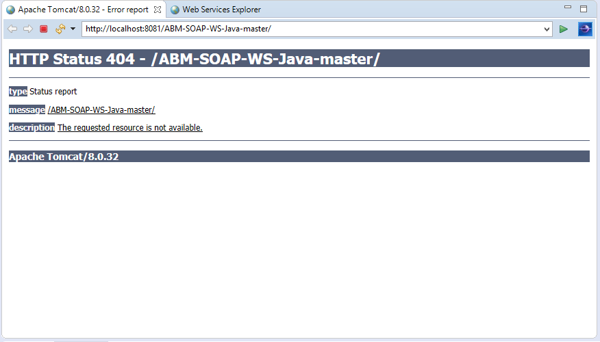
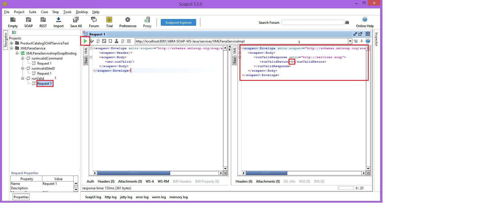

# ABM-SOAP-WS-Java
ABM developer technical question 3. SOAP web service using Java.

# Requirements
* HTTP web server(I used Apache Tomcat 8).
* Web service testing application (I used SoapUI) **OR** Java IDE (I used Eclipse)

# Deployment Instructions
Please follow the proceeding instructions to deploy the SOAP web service.

## Step 1
* Download this repository as ZIP and extract the contents.

## If you **don't** have a HTTP wer server set up
* visit https://tomcat.apache.org/download-80.cgi and install the latest version of Tomcat. **If using Windows the 32-bit/64-bit Windows Service Installer simplifies the installation process**.
* During installation, I recommend placing the HTTP/1.1 Connector on port 8081, port 8080 is a commonly used port and conflicts may occur. After installation the port can be changed by editing Apache Software Foundation\Tomcat 9.0\conf\server.xml.

## Step 2
* Copy the ABM-SOAP-WS-Java.war file from ABM-SOAP-WS-Java-master directory to Apache Software Foundation\Tomcat 9.0\webapps directory.
* Start the HTTP web server by navigating to the Apache Software Foundation\Tomcat 9.0\bin directory and running the startup.bat file.
* Test everything has been setup successfully by entering the following URL into your web browser. 
http://localhost:8081/ABM-SOAP-WS-Java/services/XMLParseServiceImpl?wsdl
* You should receive the response below:

## Step 3
* To test the web service you will need a web service testing application or a Java IDE with integrated HTTP web server (such as Tomcat). 
### Web service testing application
* I used SoapUI but there are many others available.
* Download SoapUI Open Source : https://www.soapui.org/downloads/latest-release.html and follow installation instructions.
* When you have installed and opened SoapUI, create a new SOAP project and enter http://localhost:8081/ABM-SOAP-WS-Java/services/XMLParseServiceImpl?wsdl into the Initial WSDL field.

### Java IDE
* I used Eclipse but there are many others available.
* To test the web service in Eclipse, import the ABM-SOAP-WS-Java.war file and enter ABM-SOAP-WS-Java-master for the project name.
* Run the project as "Run on server" and add the resource onto the server.
* You may be presented with the response below but this isn't a problem.

## Using the web service
* For ease of use I have included three XML files, one valid, one with an invalid command and one with an invalid site id. These can be found in the ABM-SOAP-WS-Java-master\data folder.

### To test the valid XML file:

1. Expand the runValid method in the projects tab on the left of the screen and double clock on "Request 1".
2. To run the request, click the green arrow in the top left of the Request 1 tab.
3. View the web servers response. This should return 0 indicating the document was structured correctly.

* These steps can be repeated to test the invalid command and invalid site id xml files.
